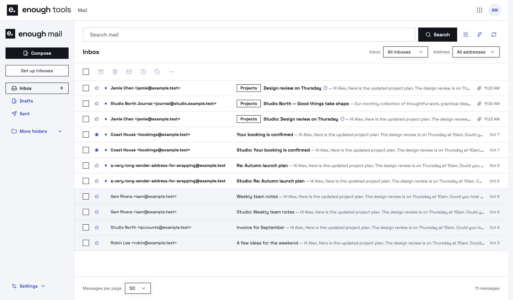
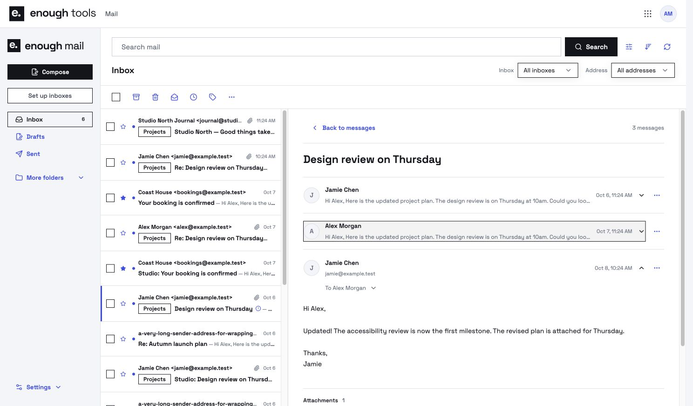
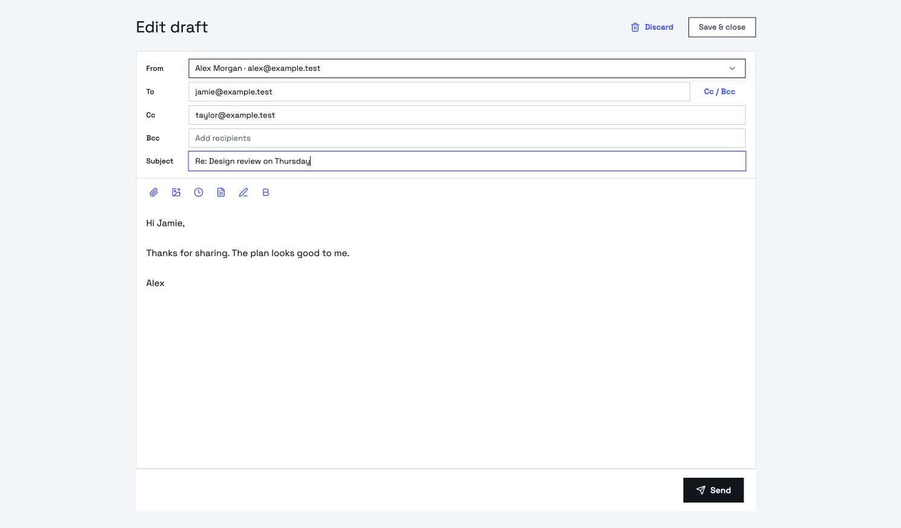

# EnoughMail

Email on infrastructure you control. A self-deployed web mail app for Cloudflare Workers, with JMAP, multiple inboxes, rich-text composition and background browser notifications.

**Self-hosted beta.** EnoughMail requires your own Cloudflare account and mail domains. There is no hosted signup service. [Product overview](https://enoughtools.com/mail) · [Deployment guide](apps/mail/README.md) · [Contributing](CONTRIBUTING.md)



## Get started

You need Node.js 22.14+, Docker, a Cloudflare account with Workers, R2, Queues, Containers and Email Sending enabled, and a domain on Cloudflare. Provider availability, quotas and charges apply.

1. Clone this repository and run `npm ci`.
2. Create a Cloudflare Access application protecting every path on your chosen Mail hostname. Record its team domain, audience and your Access subject.
3. Generate deployment configuration:

```sh
npm run mail:configure -- \
  --account YOUR_CLOUDFLARE_ACCOUNT_ID \
  --team YOUR_TEAM.cloudflareaccess.com \
  --audience YOUR_ACCESS_APPLICATION_AUDIENCE \
  --owner YOUR_ACCESS_SUBJECT \
  --hostname mail.example.com
```

4. Supply `CLOUDFLARE_API_TOKEN` for deployment and `MAIL_CF_API_TOKEN` for domain, DNS, routing and sending operations using your secret manager. See the [deployment guide](apps/mail/README.md) for permissions.
5. Run `npm run mail:deploy`. This provisions storage and queues and deploys the app, private scanner and mail ingress with Wrangler.
6. Open your Mail hostname, create an inbox, then add and verify a domain in Settings.

Repeat `npm run mail:deploy` to update the same installation. Keep generated configuration and resource names stable; do not delete Durable Objects or buckets containing mail. `npm run mail:deploy -- --dry-run` bundles without provisioning (Docker scanner validation requires a real deployment).

Already receiving mail on your domain? Follow the [domain adoption guide](docs/domain-adoption.md) to review existing DNS and forwarding routes, assign addresses to inboxes, and switch delivery with a recovery backup.

## What is included

- Multiple inboxes, labels, search, rules, contacts, templates and delegated access.
- Threaded reading, HTML mail with remote image controls, attachments and rich-text replies.
- Catch-all replies from the address that received the message, plus custom sending addresses on verified domains. [Sending addresses and ownership](docs/sending-identities.md).
- Draft recovery, submission receipts and explicit handling of uncertain send outcomes.
- JMAP state updates and opt-in encrypted Web Push notifications, including with the tab closed. Device subscriptions need periodic renewal.
- Cloudflare Email Routing and Sending integration, domain verification and a private attachment scanner.
- Optional OAuth MCP connection for ChatGPT, with mail tools and incoming-email webhook triggers. [MCP setup and events](docs/mail-mcp.md).

The browser app stays behind verified identity. A separate bounded ingress receives mail and can expose scoped JMAP client access. No Core deployment or other Enough product is required. The same bounded companion can expose an optional OAuth MCP endpoint for ChatGPT; the private workspace remains protected.

## Explore the interface

```sh
npm run demo
```

Open `http://127.0.0.1:5198`. The demo uses fictional `.test` accounts and intercepts its network calls. It does not receive or send real mail. The screenshots here use this fixture.




## Development

```sh
npm ci
npm run check
```

The check runs architecture boundaries, TypeScript, Mail tests and the production browser build. UI source lives in `apps/mail/src/ui`; product server code in `apps/mail/src`. `packages` contains the minimal platform interfaces and shared UI used by Mail. `vendor/enough-ui` is a source snapshot of [EnoughUI](https://github.com/enoughtools/enough-ui), built during installation.

Local UI development against a configured backend uses `npm run dev`; use the fixture demo for interface work without account credentials. See [CONTRIBUTING.md](CONTRIBUTING.md) for review expectations and [SECURITY.md](SECURITY.md) for private vulnerability reporting.

## License

MIT. See [LICENSE](LICENSE) and [third-party notices](THIRD_PARTY_NOTICES.md). EnoughMail is part of [Enough](https://enoughtools.com), alongside Factory, Repos and UI. Each product has its own setup and release mechanism.
